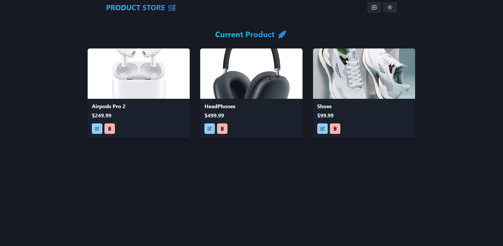

# 🛒 Product Store – MERN Full Stack App

A modern full-stack CRUD application built using the **MERN stack** (MongoDB, Express, React, Node.js), powered by **Zustand** for state management and styled with **Chakra UI** for a beautiful and responsive user interface.

Users can easily create, view, edit, and delete products — all with real-time feedback, toast notifications, and a sleek experience.

---

## ✨ Features

- ✅ Full Create, Read, Update, Delete (CRUD) functionality
- 🖼 Upload product images via URL
- ⚡ Lightning-fast frontend powered by **Vite**
- 📦 Global state management with Zustand (no boilerplate Redux)
- 🎨 Responsive and accessible UI with Chakra UI
- 🌙 Light/Dark mode toggle
- 🚀 Modal editing with animated UI transitions
- 🔔 Toast notifications for all actions

---

## 🖼 Live Demo

> [🔗 View Live Site](https://your-live-site-link.com) Not public as of right now! 
> 

---

## 📸 Screenshots

|  

---

## 🛠️ Tech Stack

### Frontend
- ⚛️ React (with Vite)
- 🎨 Chakra UI
- 📦 Zustand (state management)
- 🌐 React Router DOM

### Build Tool
- ⚡ Vite – Fast bundler & development server

### Backend
- 🟢 Node.js
- 🚂 Express
- 🍃 MongoDB (Mongoose)

---

## 🚀 Getting Started

### 1. Clone the repo

```bash
git clone https://github.com/your-username/product-store-app.git
cd product-store-app
